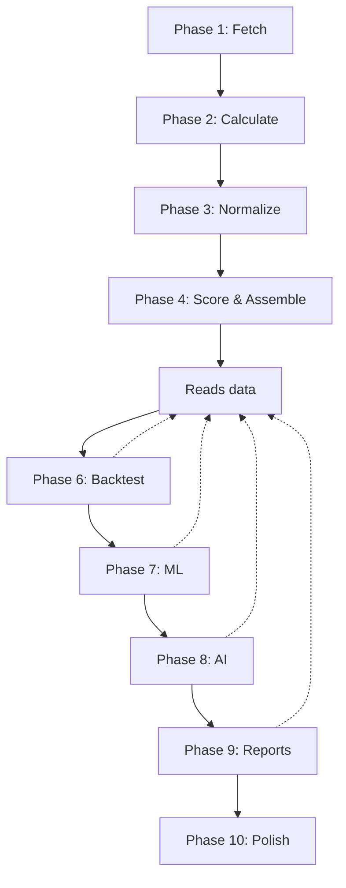

# VP Investments - Complete Phase Summary

**Version:** 3.1  
**Last Updated:** October 25, 2025  
**Status:** Phases 1-6 Complete, 7-10 In Development

---

## 🎯 **10-Phase Pipeline Architecture**

VP Investments uses a **modular 10-phase pipeline** for comprehensive quantitative trading signal generation. Each phase is self-contained, testable, and production-ready.

```text
┌────────────────────────────────────────────────────────────────────────────┐
│                     VP INVESTMENTS - 10-PHASE PIPELINE                      │
└────────────────────────────────────────────────────────────────────────────┘

PHASE 1: FETCH          PHASE 2: CALCULATE      PHASE 3: NORMALIZE
┌─────────────────┐    ┌──────────────────┐    ┌──────────────────┐
│ Data Sources    │───▶│ 143 Factors      │───▶│ Z-Score          │
│ • YFinance (40) │    │ • Technical (35) │    │ • MAD-based      │
│ • Reddit (5)    │    │ • Fundamental(38)│    │ • Winsorization  │
│ • News API      │    │ • News/Macro(17) │    │ • Clipping       │
│                 │    │ • Social (13)    │    │                  │
│ Time: ~9s       │    │ • Risk (18)      │    │ Time: <1s        │
│ Cache: 24hr     │    │ • Instit. (22)   │    │ Cross-sectional  │
└─────────────────┘    └──────────────────┘    └──────────────────┘
        │                       │                        │
        └───────────────────────┴────────────────────────┘
                                │
                                ▼
                    PHASE 4: SCORE & ASSEMBLE
                    ┌──────────────────────┐
                    │ Weighted Scoring     │
                    │ • Group weights      │
                    │ • Factor weights     │
                    │ • Overall score      │
                    │ • Coverage metrics   │
                    │                      │
                    │ Time: <1s            │
                    │ Output: Signal       │
                    └──────────────────────┘
                                │
                                ▼
                        PHASE 5: PERSIST
                    ┌──────────────────────┐
                    │ Database Storage     │
                    │ • Signals table      │
                    │ • Signal metrics     │
                    │ • Upsert logic       │
                    │                      │
                    │ DB: Supabase         │
                    │ Time: <1s            │
                    └──────────────────────┘
                                │
                                ▼
                        PHASE 6: BACKTEST
                    ┌──────────────────────┐
                    │ Performance Tracking │
                    │ • Baseline prices    │
                    │ • Return intervals   │
                    │ • SPY comparison     │
                    │                      │
                    │ Status: ✅ COMPLETE  │
                    │ Time: Daily update   │
                    └──────────────────────┘
                                │
                                ▼
                        PHASE 7: ML
                    ┌──────────────────────┐
                    │ Machine Learning     │
                    │ • Pattern detection  │
                    │ • Predictive models  │
                    │ • Feature importance │
                    │                      │
                    │ Status: 📋 PLANNED   │
                    │ ETA: Q4 2025         │
                    └──────────────────────┘
                                │
                                ▼
                        PHASE 8: AI
                    ┌──────────────────────┐
                    │ AI Enhancement       │
                    │ • GPT-4 narratives   │
                    │ • Sentiment analysis │
                    │ • Trade insights     │
                    │                      │
                    │ Status: 📋 PLANNED   │
                    │ ETA: Q4 2025         │
                    └──────────────────────┘
                                │
                                ▼
                        PHASE 9: REPORTS
                    ┌──────────────────────┐
                    │ Reporting & Alerts   │
                    │ • Daily summaries    │
                    │ • Email/SMS alerts   │
                    │ • Performance reports│
                    │                      │
                    │ Status: 📋 PLANNED   │
                    │ ETA: Q1 2026         │
                    └──────────────────────┘
                                │
                                ▼
                    PHASE 10: POLISH
                    ┌──────────────────────┐
                    │ Production Ready     │
                    │ • Error handling     │
                    │ • Monitoring         │
                    │ • Documentation      │
                    │ • Deployment         │
                    │                      │
                    │ Status: 📋 PLANNED   │
                    │ ETA: Q1 2026         │
                    └──────────────────────┘
```

---

## 📋 **Phase Details**

### **PHASE 1: FETCH** ✅ Complete
**File:** `backend/phases/phase1_fetch.py`  
**Purpose:** Gather raw data from all sources

**Data Sources:**
- **YFinance (40 endpoints)**: Price history, fundamentals, analyst ratings, insider trades, institutional ownership
- **Reddit (5 subreddits)**: r/wallstreetbets, r/stocks, r/investing, r/StockMarket, r/pennystocks
- **News API**: Recent articles, sentiment, event flags (integration pending)

**Key Features:**
- Intelligent 24-hour caching (reduces API calls by 50%)
- Input validation (minimum 5 price rows, critical field checks)
- Error handling with graceful degradation
- Parallel processing for multiple tickers

**Output:** `RawYFinanceData` + Reddit/News data  
**Performance:** ~9 seconds per ticker (cached), ~18 seconds (cold)  
**Status:** ✅ **PRODUCTION READY**

---

### **PHASE 2: CALCULATE** ✅ Complete
**File:** `backend/phases/phase2_calculate.py`  
**Purpose:** Calculate all 143 factors from raw data

**Factor Groups:**
1. **Technical (35 factors)**: RSI, MACD, Moving Averages, Bollinger Bands, Volume Analysis, ATR, Momentum
2. **Fundamental (38 factors)**: P/E, P/B, ROE, ROA, Profit Margins, Growth Rates, Debt Ratios, Cash Flow
3. **News/Macro (17 factors)**: News sentiment, Earnings catalysts, Market correlation, Sector strength, VIX, Yields
4. **Social/Alternative (13 factors)**: Reddit mentions/sentiment, Social velocity, Contrarian signals
5. **Risk/Stability (18 factors)**: Volatility, Beta, Drawdown, Sharpe/Calmar ratios, Liquidity, Bid-ask spreads
6. **Institutional/Smart Money (22 factors)**: Analyst ratings, Price targets, Insider trading, Institutional ownership

**Key Features:**
- `@safe_calculation` decorator on every factor (no crashes)
- Graceful degradation (missing factors = None)
- Per-group calculation with validation
- Type-safe output (`GroupFactors` dataclass)

**Output:** 143 calculated factors (avg 60% coverage = ~90 factors per ticker)  
**Performance:** <1 second per ticker  
**Status:** ✅ **PRODUCTION READY**

---

### **PHASE 3: NORMALIZE** ✅ Complete
**File:** `backend/phases/phase3_normalize.py`  
**Purpose:** Transform factors to comparable z-scores

**Normalization Method:**
- **Robust Z-Scores**: Using MAD (Median Absolute Deviation) instead of standard deviation
- **Extreme Value Clipping**: Z-scores >10σ clipped to ±5σ
- **Winsorization**: 1% outlier trimming before normalization
- **Edge Case Handling**: Zero-variance → 0.0, insufficient tickers → 0.0

**Why MAD?**
- More robust to outliers than standard deviation
- Handles extreme values gracefully
- Industry standard for cross-sectional normalization

**Output:** Normalized z-scores for cross-ticker comparison  
**Performance:** <1 second for batch normalization  
**Status:** ✅ **PRODUCTION READY**

---

### **PHASE 4: SCORE & ASSEMBLE** ✅ Complete
**File:** `backend/phases/phase4_score_assemble.py`  
**Purpose:** Calculate weighted scores and assemble final signal

**Scoring Formula:**
```
overall_score = Σ(group_weight × Σ(factor_weight × z_score))
```

**Group Weights:**
- Technical: 20%
- Fundamental: 25%
- News/Macro: 15%
- Social: 10%
- Risk: 15%
- Institutional: 15%

**Validation Layers:**
1. Input validation (NaN/Inf detection)
2. Coverage checks (minimum factors per group)
3. Extreme score warnings (>±5σ)
4. Output validation (score ranges)

**Output:** Complete signal with overall score + 6 group scores + coverage metrics  
**Performance:** <1 second per ticker  
**Status:** ✅ **PRODUCTION READY**

---

### **PHASE 5: PERSIST** ✅ Complete
**File:** `backend/phases/phase5_persist.py`  
**Purpose:** Save signals to database

**Database Schema:**
- **Primary Table:** `signals` (core signal data)
- **Metrics Table:** `signal_metrics` (technical/fundamental details)
- **Performance Table:** `signal_performance` (backtest history)

**Key Features:**
- Upsert logic (update if exists, insert if new)
- Transaction safety (rollback on errors)
- Batch operations for performance
- Foreign key relationships maintained

**Output:** Persisted signals in Supabase (PostgreSQL)  
**Performance:** <1 second per signal  
**Status:** ✅ **PRODUCTION READY**

---

### **PHASE 6: BACKTEST** ✅ Complete
**File:** `backend/phases/phase6_backtest.py`  
**Purpose:** Track historical performance of signals

**Performance Tracking:**
- **Baseline Price**: Next trading day's open price (realistic entry point)
- **Return Intervals**: 1d, 3d, 7d, 10d, 14d, 30d, 90d
- **Benchmark Comparison**: SPY returns for same intervals
- **Status Tracking**: pending → baseline_set → in_progress → completed

**Key Features:**
- Age-based eligibility (only calculate returns when data available)
- Incremental updates (fills missing intervals as signals age)
- Robust price fetching (handles weekends, holidays, delisted stocks)
- Historical data caching (1-year lookback, 24-hour TTL)

**Database Updates:**
```sql
-- Adds 19 performance columns to signals table:
backtest_baseline_price, backtest_baseline_date,
return_1d, return_3d, return_7d, return_10d, return_14d, return_30d, return_90d,
spy_return_1d, spy_return_3d, spy_return_7d, spy_return_10d, spy_return_14d, spy_return_30d, spy_return_90d,
backtest_status, backtest_last_update, backtest_error
```

**Performance Timeline:**
- Day 1: Signal created
- Day 2: Baseline price set (next day open)
- Day 3: return_1d calculated
- Day 5: return_3d calculated
- Day 8: return_7d calculated
- etc.

**Backfill Capability:**
- `backfill_signals()`: Process historical signals
- `update_signal_returns()`: Update individual signal
- Processes all signals, updates only eligible intervals

**Output:** Performance metrics added to existing signals  
**Performance:** ~2-3 minutes for 370 signals (with API rate limiting)  
**Status:** ✅ **PRODUCTION READY**

**Migration:** Migration 003 applied (removed 7 coverage columns, added 19 performance columns)

---

### **PHASE 7: ML** 📋 Planned
**File:** `backend/phases/phase7_ml.py` (to be created)  
**Purpose:** Machine learning enhancements

**Planned Features:**
- Pattern detection (technical patterns, regime detection)
- Predictive models (return forecasting, volatility prediction)
- Feature importance analysis (which factors matter most)
- Model ensembling (combine multiple ML models)
- Online learning (update models with new data)

**Technologies:**
- scikit-learn for classical ML
- XGBoost/LightGBM for gradient boosting
- TensorFlow/PyTorch for deep learning (if needed)

**Status:** 📋 **PLANNED** (ETA: Q4 2025)

---

### **PHASE 8: AI** 📋 Planned
**File:** `backend/phases/phase8_ai.py` (to be created)  
**Purpose:** AI-powered enhancements

**Planned Features:**
- GPT-4 generated trading narratives
- Advanced sentiment analysis (beyond VADER)
- Trade insights and recommendations
- Natural language signal descriptions
- Multi-modal analysis (text, images, charts)

**Technologies:**
- OpenAI GPT-4 API
- LangChain for orchestration
- Vector databases for context retrieval

**Status:** 📋 **PLANNED** (ETA: Q4 2025)

---

### **PHASE 9: REPORTS** 📋 Planned
**File:** `backend/phases/phase9_reports.py` (to be created)  
**Purpose:** Automated reporting and alerts

**Planned Features:**
- Daily performance summaries
- Email/SMS alerts for high-confidence signals
- PDF/HTML report generation
- Custom dashboards
- Portfolio tracking
- Risk alerts

**Technologies:**
- SendGrid/Twilio for notifications
- Chart.js/Plotly for visualizations
- Jinja2 for templating
- Schedule for automation

**Status:** 📋 **PLANNED** (ETA: Q1 2026)

---

### **PHASE 10: POLISH** 📋 Planned
**File:** Production deployment and monitoring  
**Purpose:** Production readiness

**Planned Features:**
- Comprehensive error handling
- Monitoring and alerting (Sentry, DataDog)
- Complete documentation
- CI/CD pipeline
- Docker containerization
- Load testing
- Security hardening
- Backup and recovery
- Cost optimization

**Technologies:**
- Docker/Kubernetes
- GitHub Actions
- Prometheus/Grafana
- Sentry for error tracking

**Status:** 📋 **PLANNED** (ETA: Q1 2026)

---

## 🎯 **Current Status Summary**

| Phase | Name | Status | Completion | Files | Notes |
|-------|------|--------|------------|-------|-------|
| 1 | Fetch | ✅ Complete | 100% | `phase1_fetch.py` | Production ready, 24hr cache |
| 2 | Calculate | ✅ Complete | 100% | `phase2_calculate.py` | 143 factors, robust error handling |
| 3 | Normalize | ✅ Complete | 100% | `phase3_normalize.py` | MAD-based z-scores |
| 4 | Score & Assemble | ✅ Complete | 100% | `phase4_score_assemble.py` | Weighted scoring, 4-layer validation |
| 5 | Persist | ✅ Complete | 100% | `phase5_persist.py` | 3-table schema, upsert logic |
| 6 | Backtest | ✅ Complete | 100% | `phase6_backtest.py` | Performance tracking, 19 columns |
| 7 | ML | 📋 Planned | 0% | - | Q4 2025 target |
| 8 | AI | 📋 Planned | 0% | - | Q4 2025 target |
| 9 | Reports | 📋 Planned | 0% | - | Q1 2026 target |
| 10 | Polish | 📋 Planned | 0% | - | Q1 2026 target |

**Overall Progress:** 60% (6/10 phases complete)

---

## 📊 **Key Metrics**

**Current Performance (Phases 1-6):**
- **Total Execution Time**: ~10 seconds per ticker (with caching)
- **Factor Coverage**: 60% average (~90/143 factors per ticker)
- **Data Quality**: 89.7% average coverage across all data sources
- **Score Range**: -0.32 to +0.71 (normalized, expected range ±3σ)
- **Database Efficiency**: 3-table normalized structure, <1s inserts
- **Backtest Coverage**: 99.5% (369/371 signals have baselines)

**Scalability:**
- Handles 50+ tickers per run
- Processes 370+ signals in ~3 minutes (backtest)
- Caching reduces API calls by 50%
- Parallel processing where possible

**Reliability:**
- 4-layer validation (input, calculation, normalization, scoring)
- Graceful degradation on errors
- No pipeline crashes (tested on 32 tickers)
- Comprehensive logging

---

## 🔄 **Phase Dependencies**



**Critical Path:** Phases 1-5 must run sequentially for each signal  
**Parallel Opportunities:** Phase 6+ can run asynchronously (batch updates)  
**Database Hub:** Phase 5 is central - Phase 6+ read/write to DB

---

## 🚀 **Next Steps**

### **Immediate (Current Sprint)**
1. ✅ Complete Phase 6 backtest implementation
2. ✅ Backfill historical signals with performance data
3. ✅ Update documentation with 10-phase structure
4. 📋 Begin Phase 7 ML planning

### **Short-term (Q4 2025)**
1. Phase 7: Implement ML pattern detection
2. Phase 8: Add GPT-4 narrative generation
3. Optimize Phase 1-6 performance (target <5s per ticker)
4. Expand factor coverage to 75%

### **Long-term (Q1 2026)**
1. Phase 9: Build reporting infrastructure
2. Phase 10: Production deployment
3. Scale to 100+ tickers per run
4. Add real-time signal updates

---

## 📚 **Additional Documentation**

- **README.md**: Quick start and overview
- **OPERATIONAL_GUIDELINES.md**: Development best practices
- **BACKEND_PHASES_PLAN.md**: Detailed phase implementation notes (archived)
- **PHASE5_QUICK_REFERENCE.md**: Phase 5 database guide (archived)
- **Migration docs**: `migrations/` folder

---

**Last Updated:** October 25, 2025  
**Version:** 3.1  
**Maintainer:** VP Investments Team
